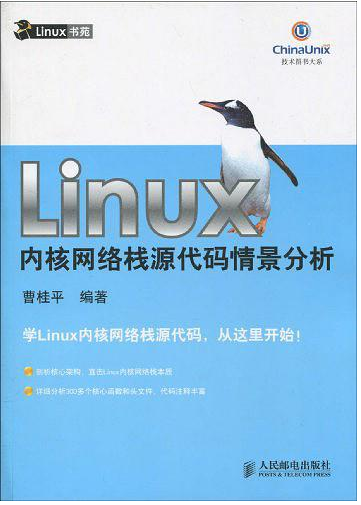

# Linux 1.2.13网络协议栈学习笔记


## 相关站点

* <https://yifengyou.gitbooks.io/linux-net/content/>
* <https://github.com/yifengyou/linux-net/>
* <https://yifengyou.github.io/linux-net/>

```
Something I hope you know before go into the coding~
First, please watch or star this repo, I'll be more happy if you follow me.
Bug report, questions and discussion are welcome, you can post an issue or pull a request.
```

## 参考书目



## 内容简介

《Linux内核网络栈源代码情景分析》主要对Linux1.2.13内核协议栈的全部源代码做了详细的分析，该版本所有代码都在一个文件夹中，每种协议的实现都只有一个文件与之对应，分析该版本源代码可以方便读者迅速掌握Linux网络协议结构。

《Linux内核网络栈源代码情景分析》共分为5个部分。具体内容包括网络栈总体架构分析、网络协议头文件分析、BSDsocket层实现分析、INETsocket层实现分析、网络层实现分析、链路层实现分析、网络设备驱动程序分析、系统网络栈初始化等内容。

《Linux内核网络栈源代码情景分析》适合Linux网络开发人员及Linux内核爱好者阅读。

## 目录

* [Linux内核网络栈源代码情景分析](README.md)
* [第0章-网络栈总体架构分析](docs/第0章-网络栈总体架构分析/第0章-网络栈总体架构分析.md)
* [第1章-网络协议头文件分析](docs/第1章-网络协议头文件分析/第1章-网络协议头文件分析.md)
* [第2章-BSD socket层实现分析](docs/第2章-BSDsocket层实现分析/第2章-BSDsocket层实现分析.md)
* [第3章-INET socket层实现分析](docs/第3章-INETsocket层实现分析/第3章-INETsocket层实现分析.md)
* [第4章-传输层实现分析](docs/第4章-传输层实现分析/第4章-传输层实现分析.md)
* [第5章-网络层实现分析](docs/第5章-网络层实现分析/第5章-网络层实现分析.md)
* [第6章-链路层实现分析](docs/第6章-链路层实现分析/第6章-链路层实现分析.md)
* [第7章-网络设备驱动程序分析](docs/第7章-网络设备驱动程序分析/第7章-网络设备驱动程序分析.md)
* [第8章-系统网络栈初始化](docs/第8章-系统网络栈初始化/第8章-系统网络栈初始化.md)
* [勘误](docs/勘误/勘误.md)
