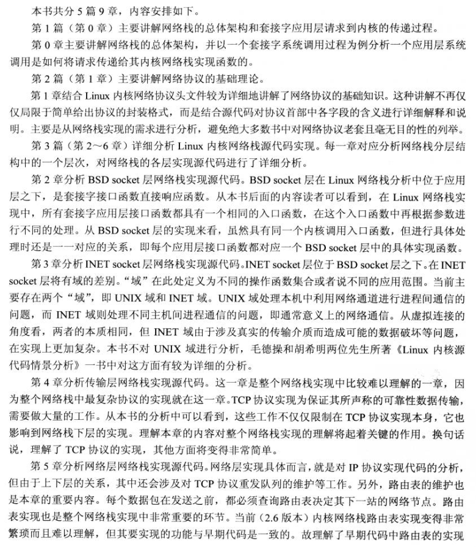
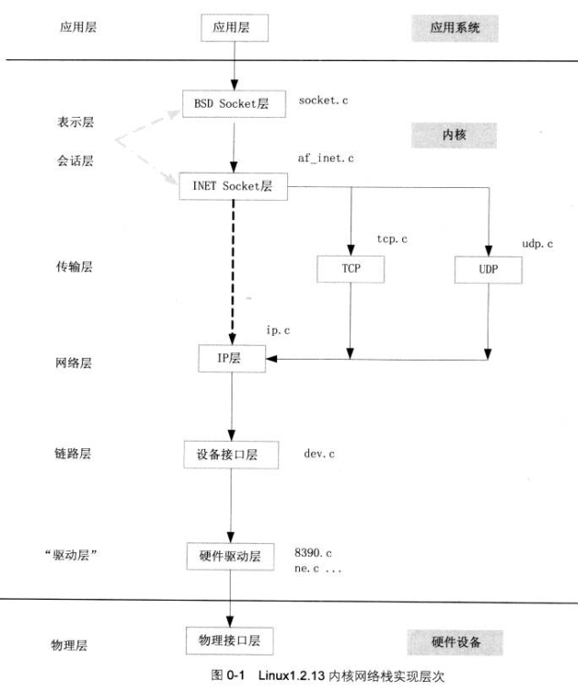
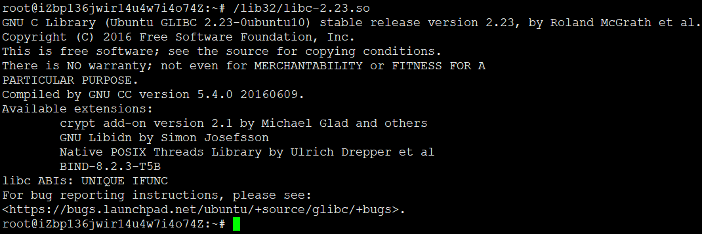
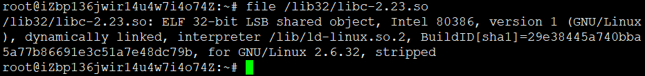
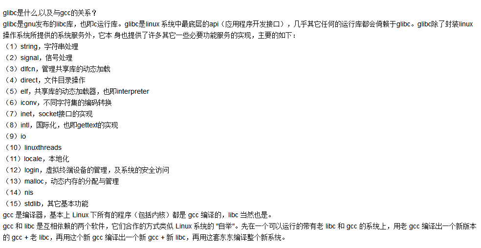
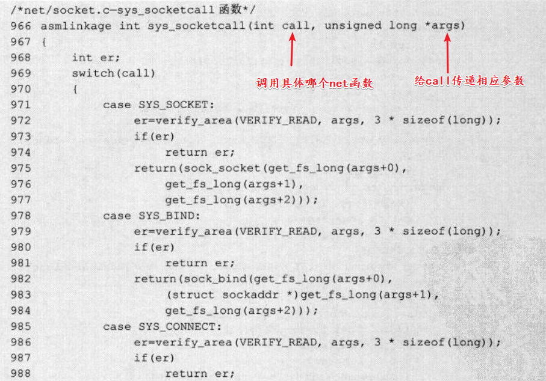

# 第0章-网络栈总体架构分析

* 所谓栈，就是一层一层的结构，分层架构
* 网络栈就是按照预先设定的一套规则，对用户数据进行封装从而达到主机之间数据传递的目的。
* 网络栈是一套网络协议构成，而网络协议本质是就是规则：为了实现主机之间的通信，必须遵守同一套规则，好比一起玩游戏，游戏规则总是要有的，破坏规则都是要被惩罚的。
* 数据的封装格式必须是可动态扩展的，数据在每层上都进行本层的封装，之后传递到下一层。
* 分层设计方式对于不同层次加入新的服务提供了扩展性，也使得数据封装格式的设计具有了很大的灵活性。
* 早起网络设定为四层：数据链路层、网络层、传输层、应用层
* OSI七层网络战：（物理层）、数据链路层、网络层、网络层、传输层、（会话层、表示层、应用层）
* Linux是一个类Unix系统，网络编程方式使用BSD套接字
* Linux 0.96C版本开始包含网络diamante，Linux 1.3.0之前都是早期版本，所有网络代码都包含在一个文件夹中，每种协议的实现都有一个文件夹对应，结构层次较为简单。其后就变得复杂
* libc、glibc、uclibc、klibc都是标准C库，libc是泛指，也可以指以前淘汰掉的早期的C库
* 嵌入式行业里还常用 uClibc ，是一个迷你版的 libc 。
* glib是GTK+的基础库，它由基础类型、对核心应用的支持、实用功能、数据类型和对象系统五个部分组成
* 错误观点：glib 前面有个 "g" ，所以认为 glib 是 GNU 的东东；同时认为 glibc 是 glib 的一个子集。
* glib 和 glibc 基本上没有太大联系，可能唯一的共同点就是，其都是 C 编程需要调用的库而已。glib 是 Gtk+ 库和 Gnome 的基础。glib 可以在多个平台下使用，比如 Linux、Unix、Windows 等。glib 为许多标准的、常用的 C 语言结构提供了相应的替代物。
*  GNU C 函数库是一种类似于第三方插件的东西。由于 Linux 是用 C 语言写的，所以 Linux 的一些操作是用 C 语言实现的，因此，GUN 组织开发了一个 C 语言的库 以便让我们更好的利用 C 语言开发基于 Linux 操作系统的程序。不过现在的不同的 Linux 的发行版本对这两个函数库有不同的处理方法，有的可能已经集成在同一个库里了。
* glibc 和 libc 都是 Linux 下的 C 函数库。 libc 是 Linux 下的 ANSI C 函数库；glibc 是 Linux 下的 GUN C 函数库。
* glibc是linux下面c标准库的实现，即GNU C Library。glibc本身是GNU旗下的C标准库，后来逐渐成为了Linux的标准c库，而Linux下原来的标准c库Linux libc逐渐不再被维护。Linux下面的标准c库不仅有这一个，如uclibc、klibc，以及上面被提到的Linux libc，但是glibc无疑是用得最多的。glibc在/lib目录下的.so文件为libc.so.6。

* glibc和linux kernel的关系：glibc知道kernel的接口，所有系统调用，以及使用系统调用的所有规范，那么应用程序可以不必要犯智障错误直接调用系统调用，而是通过glibc简介调用。可以说，glibc是在你调用系统调用之前做的一些检查。当然还有很多杂七杂八的工作。
* 系统调用是不可能在C库中实现，C库是系统调用的封装和检查
* 所有网络套接字系统调用函数都是用统一的入口函数：**sys_socketcall**，所以socket、bind、listen、connect等都是最终调用改系统调用，只是传入的参数不一样而已。

* 可以看到，每个net函数最终都在sys_socketcall有对应的switch项，在调用那个最终的net函数前都是一大堆检查。
