# 第1章-网络协议头文件分析

* 头文件一般在<linux/XXX.H>或者<asm/XXX.s>，区别在于是否与体系结构相关，本质就是硬件不同，且过于底层。

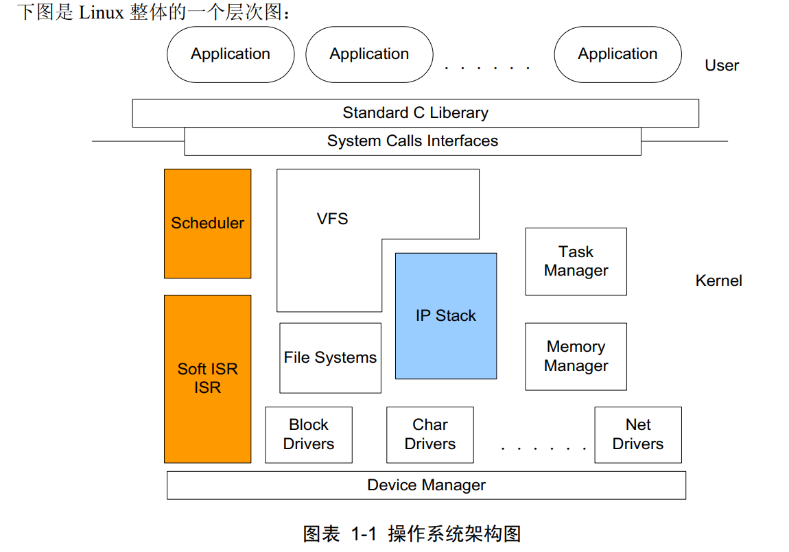

* TCP/IP 本身是一个协议族， 还包含了 ARP， ICMP， UDP 等协议。它从开始提出到现在的广泛使用，已经差不多 30 年了，在这段时间内，不管是大型组织还是公司都提出其他类型的网络协议栈试图取代 TCP/IP，但都没有成功，反而是 IP 协议逐渐蚕食其他网络市场的分额，比如 IPX。

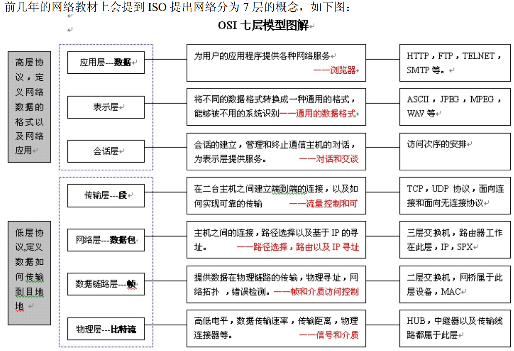

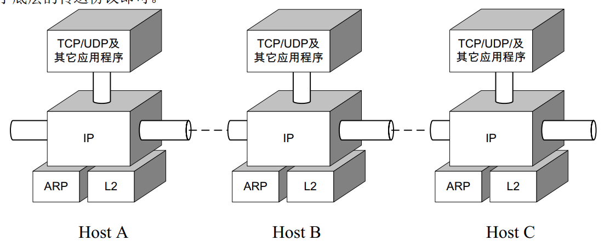

* 世界上的每一台机器通过协议栈相连，其基本形式大概也就是上图所示，只不过有的实现是 Linux，有的是 UNIX/BSD，有的是 Windows 系统提供的协议栈，当然还有一般人看不见的网络设备中厂商自己实现的协议栈。
* 每一类软件模块都不能独立存在， 必定依托系统其它模块的支持才能工作，协议栈更是如此， 由于协议栈是在内核中实现，所以，必须搞清楚操作系统中是如何支持协议栈的

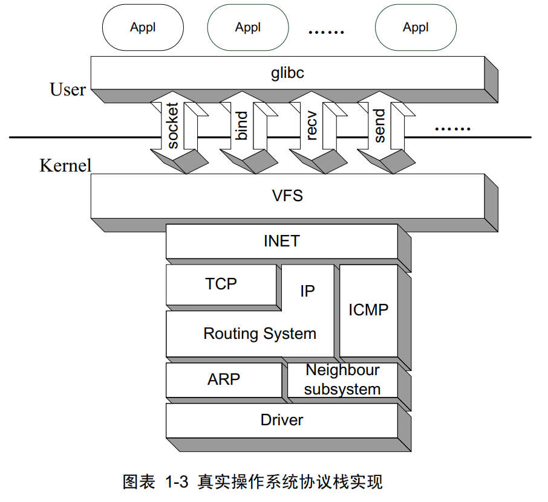

* glibc 库，对于大多数从事软件编程 2 年以下的读者，这个部分比较难理解。其实我们几乎无时无刻不与这个部分打交道， 比如说不管是应用层软件开发，还是嵌入式软件开发，我们用过的 malloc 函数、 strcpy 函数都是这个库提供的。不仅如此，网络编程中用到的 API 接口也是这个库提供的。
* INET， 它不属于 TCP/IP 体系必须的一个部分， 但 TCP/IP 层的接口要通过 INET 层才能访问操作，这一操作是在网络初始化时就已经注册到 BSD 风格的 socket 层的。 所谓 BSD 风格就是我们常说的 socket、 bind、 connect、 listen、 send 和 recv 等系统接口的调用风格。不管是类 UNIX 还是Windows 操作系统都必须实现这些接口，这些接口内部不仅支持你上网（就是 AF_INET），还支持你的应用程序之间的通信（比如 AF_UNIX），或者内核与用户之间通信（AF_NETLINK），甚至一些少见的协议（比如 AF_IPX），但就本书的内容显然属于AF_INET 层的范围，它封装了 TCP/IP 的接口。

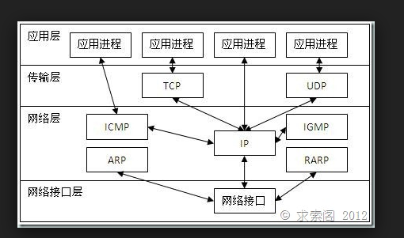

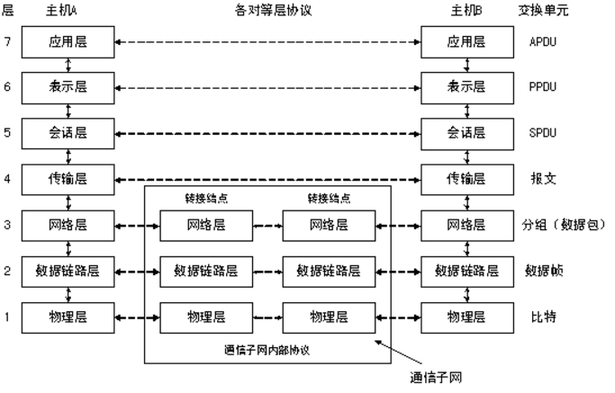

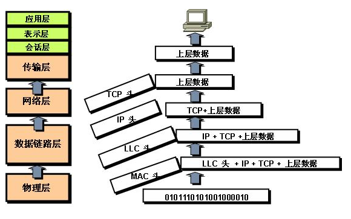

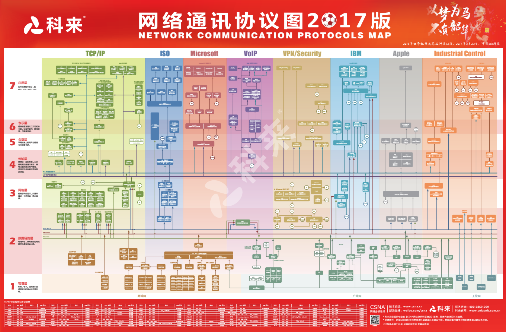

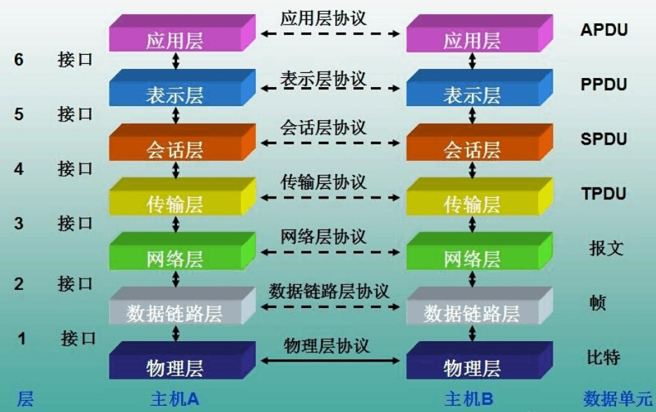

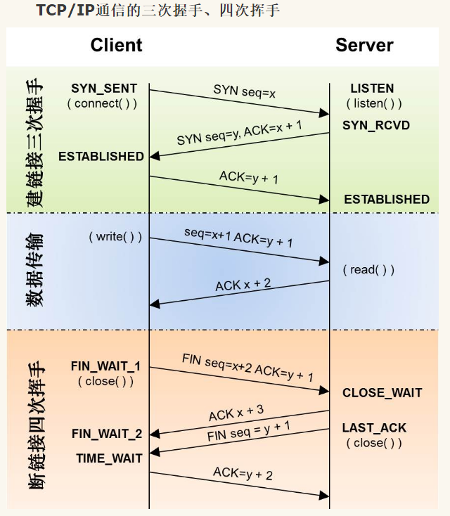

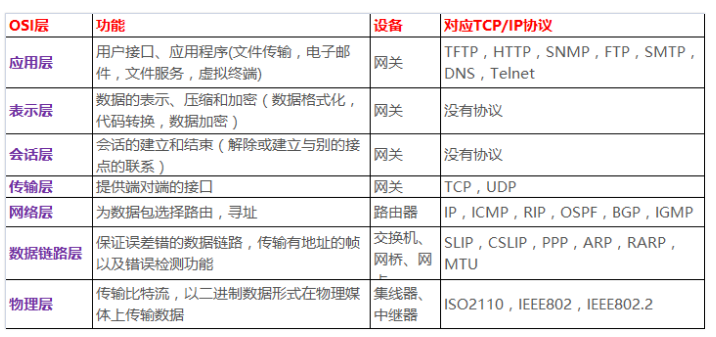

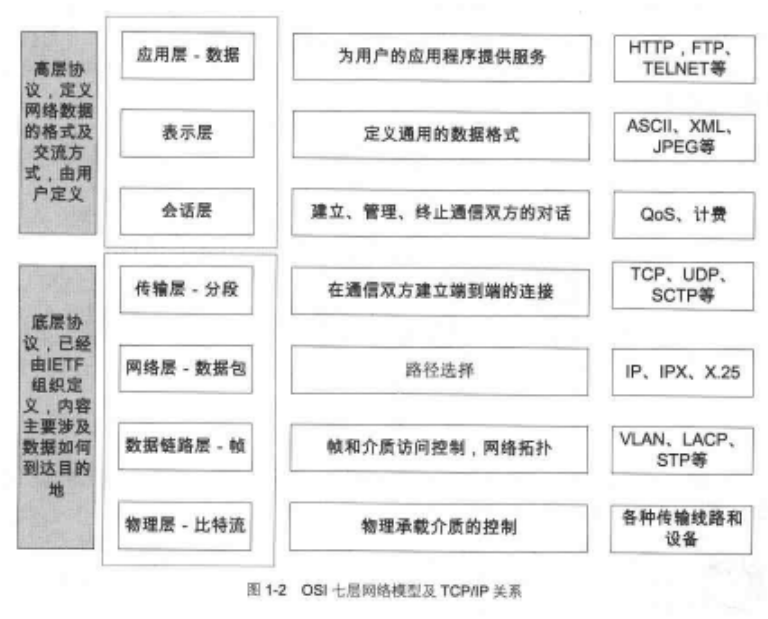

*

## END
